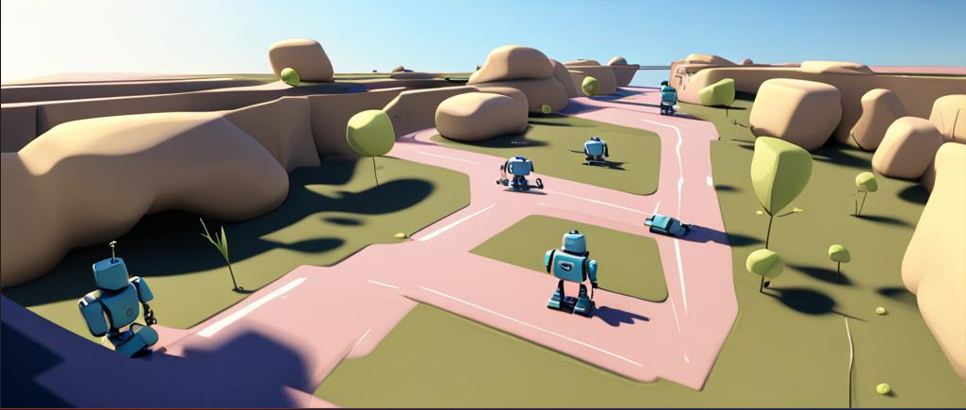
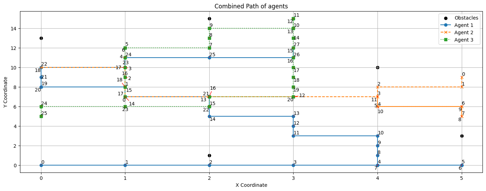

<div align="center">


# ⚡ Multi Agent Path Finding

[](https://www.python.org/downloads/release/python-390/)

[](https://www.sciencedirect.com/science/article/pii/S0004370214001386)

</div>

&nbsp;

# Problem Statement
<div align = "justify">
<i>
The problem involves scheduling 'k' robots on a 2-D grid to minimize the overall completion time for 'k' shipment tasks. Each robot starts at a designated location, 
picks up a component, delivers it, and moves to a final destination. Obstacles on the grid must be navigated around.
</i>
</div>

# Getting Started

## Basic Idea:
```
1. Break the problem into three cases for finding the path:
    a. Start to Pick-up location
    b. Pick-up location to Drop Location
    c. Drop location to Destination
2. Utilize Low-Level Implementation of CBS to find the path of these three cases independently, by employing the A* algorithm
3. Follow this step to find the path of all 'k' agents
4. Finally, use the High-Level Implementation of CBS to resolve conflicting paths among 'k' agents
```

## Solution Steps
### 1. Initialization:
> a. Define the dimension of the shop floor, the number of robots, obstacles, starting points, pick-up points, drop locations, and final destinations.

> b. Specify all constraints, such as the boundary of the floor, conflict constraints, and obstacles that robots should consider while finding an optimal path. Ensure that no two agents can occupy the same position (x, y) at time t.

> c. Define the cost function and the optimal heuristic. For instance, consider Euclidean distance as a heuristic.

### 2. Low-Level Search:
> a. Apply the A* Algorithm for each robot to compute optimal paths from start to goal, considering all defined constraints and heuristics.

### 3. High-Level Search:
> a. Define a validate function to check for conflicting states among all agents.

> b. Use the CBS algorithm to find non-conflicting paths by considering robot task assignments and resolving conflicts.

### 4. Execution:
> a. Utilize CBS in a stepwise manner. Initially, use it to find an optimal path from the starting point to the pick-up point, then find the optimal path from the pick-up point to the drop location, and finally from the drop location to the final destination.

# Example 
<div align="justify">
Consider three agents: A1, A2, and A3. Each agent is initially positioned at R1, R2, and R3, respectively. Their tasks involve picking up items from locations P1, P2, and P3, delivering them to destinations E1, E2, and E3, and finally moving to their respective final destinations D1, D2, and D3. The environment contains obstacles that need to be navigated around. The objective is to schedule and optimize the paths for each agent, ensuring they complete their tasks efficiently and reach their final destinations while considering the presence of obstacles.
</div>
&nbsp;


```
starting coordinates: [(0, 0), (5, 9), (1, 7)]
pickup coordinates: [(5, 0), (4, 6), (1, 12)]
droping coordinates: [(0, 8), (5, 5), (3, 15)]
destination coordinates: [(3, 12), (0, 10), (0, 5)]
obstacles coordinates: [(0, 13), (2, 1), (2, 15), (4, 10), (5, 3)]
```

Therefore, Optimal path for each agents will be 
<i>
>For Agent 1: [(0, 0), (1, 0), (2, 0), (3, 0), (4, 0), (5, 0), (5, 0), (4, 0), (4, 1), (4, 2), (4, 3), (3, 3), (3, 4), (3, 5), (2, 5), (2, 6), (2, 7), (1, 7), (1, 8), (0, 8), (0, 8), (0, 9), (0, 10), (1, 10), (1, 11), (2, 11), (3, 11), (3, 12)]

> For Agent 2: [(5, 9), (5, 8), (4, 8), (4, 7), (4, 6), (4, 6), (5, 6), (5, 5), (5, 5), (5, 6), (4, 6), (4, 7), (3, 7), (2, 7), (1, 7), (1, 8), (1, 9), (1, 10), (0, 10)]

> For Agent 3: [(1, 7), (1, 8), (1, 9), (1, 10), (1, 11), (1, 12), (1, 12), (2, 12), (2, 13), (2, 14), (3, 14), (3, 15), (3, 15), (3, 14), (3, 13), (3, 12), (3, 11), (3, 10), (3, 9), (3, 8), (3, 7), (2, 7), (2, 6), (1, 6), (0, 6), (0, 5)]
</i>


NOTE: Numbers shows the time at which each agent is at location (x, y)


# What Next?
1. Using Kmeans algoritm to distribute the task to each robot
2. Extend it to multiple task system, currently each agent can perform only one task
3. Which task to perform first in multi-task system 

